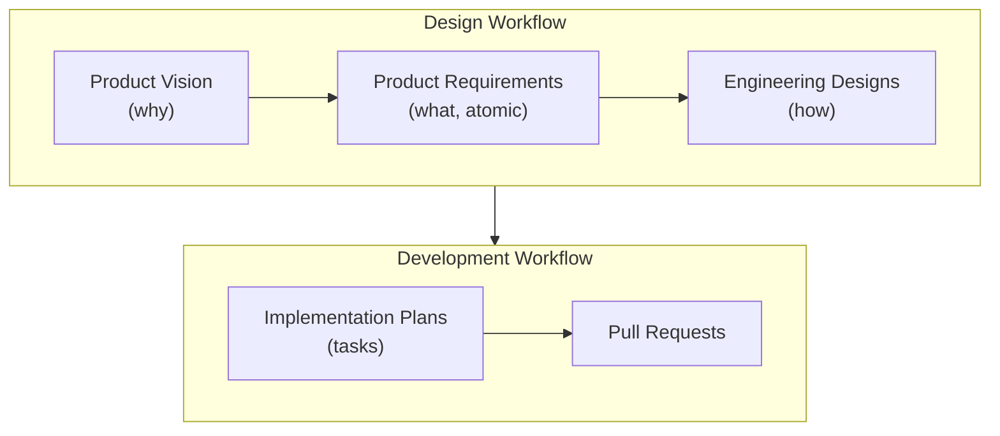

# Design and Planning Process

The repo's `design/` directory contains all shared project design documentation,
  organized by type.
Domain- and application- specific design documentation
  will appear in their respective directories.

## What is the Design and Development Workflow?

The design docs are used to drive and guide the development of new features and capabilities.
These documents are generally created/updated either during or before their implementation.



1. The **Design Workflow** is...
  1. [**Product Vision**](product-vision/README.md):
     ensure that your goals/work align with a new or existing product vision,
     which capture the high-level goals and direction for the product.
  2. [**Product Requirements**](product-requirements/README.md):
     break out each new feature or capability that you'll be implementing into product requirements,
     which capture the user story and acceptance criteria for each feature.
     Once fully implemented, Product Requirements are generally immutable,
     with any divergences from earlier requirements being captured in _new_ Product Requirements,
     mutually cross-linked with the ones that they supercede.
  3. [**Engineering Designs**](engineering-designs/README.md):
     capture any significant decisions that guide the architecture and design
     of the projects, modules, and other components in the repository.
     Should be evergreen: Engineering Designs should be updated as the system evolves.
    1. [**Engineering Principles**](engineering-principles/README.md):
       codify the higher-level, cross-cutting, or philosophical standards and norms
       that all Engineering Designs, Implementation Plans, and code should align with.
2. The **Development Workflow** is...
  1. [**Implementation Plans**](implementation-plans/README.md):
     capture the detailed steps and tasks that are planned to implement a feature or capability.
     These plans are ephemeral: they capture a specific plan at a specific point in time
     and may change or be superceded as the implementation evolves.
  2. [**Pull Requests**](/.claude/rules/pr-workflow.md):
     are used to prepare, review, and merge all changes
     \— design documents, implementation plans, and the actual implementations \—
     and this is enforced via the GitHub project's branch protection rules.
     Note that, unless a PR's commits are very carefully curated,
     they should generally be squashed before merging;
     the `main` branch's commit history should tell a clear story of the project's evolution.

### What Are the Key Principles of this Workflow?

This workflow's design is guided by these principles and observations:

1. The _why_ is foundational for all projects and their features:
     without a clear understanding the goals driving the work,
     it is difficult to make informed decisions about what to build and how to build it.
2. The _what_ needs to be as clear and unambiguous as possible:
     development is a messy process, full of experiments, dead ends, and iterative refinement.
   But humans (and agents) need clear guidance on what to build;
     overlapping, overlarge, and/or confusing requirements will invariably
     lead to wasted effort and a failure to deliver the desired value/benefit.
3. The _how_ should be guided by experience, with an eye towards simplicity and reliability:
     bugs, bitrot, and rework will sap motivation and grind progress to a standstill.

## When Should the Design Process Be Followed?

- **New features and significant enhancements**
    should have design docs created before (or alongside) implementation.
- **Simple bug fixes, maintenance, and infrastructure changes**
    can skip directly to implementation.

## How Is the Design and Development Documentation Organized?

The design and development documentation is broken out into the following subdirectories:

- [`product-vision/`](product-vision/):
    over-arching goals and story that tie the product requirements together.
- [`product-requirements/`](product-requirements/):
    specific user stories and acceptance criteria for each feature.
- [`engineering-principles/`](engineering-principles/):
    higher-level, cross-cutting, or philosophical standards and norms.
- [`engineering-designs/`](engineering-designs/):
    significant decisions that guide architecture and design.
- [`implementation-plans/`](implementation-plans/):
    detailed steps and tasks that are planned to implement a feature or capability.
- [`analyses/`](analyses/):
    research, experiments, and/or evaluations that inform design and implementation decisions.
- [`notes/`](notes/):
    miscellaneous notes, observations, and half-baked ideas.

### Naming Conventions

#### Single-File Documents

Format: `YYYY-MM-DD-short-name.md`

Examples:

- `2025-01-15-initial-feature-set.md`
- `2025-01-20-resume-boosting-engineering-designs.md`
- `2025-02-01-user-research-findings.md`

#### Multi-File Documents

For documents that require multiple files
  (e.g., phased implementation plans, analysis with supporting materials):

Format: `YYYY-MM-DD-short-name/` directory containing:

- `README.md` - Main document
- Additional supporting files as needed

Examples:

```
2025-01-25-onboarding-flow/
  README.md
  user-journey-map.md
  wireframes.png

2025-02-10-backend-architecture/
  README.md
  phase-1-mvp.md
  phase-2-scaling.md
  database-schema.sql
```

#### Naming Style Guide

- Each document has a unique **title** (≤10 words): used in the document's heading.
- Each document has a unique **short name** (3–5 words): a kebab-case condensation of the title,
    used in the filename.
- Use kebab-case for all file and directory names (compatible with both Rust and Swift projects).
- Dates always in ISO 8601 format: YYYY-MM-DD.
- All documents should be in Markdown format unless a different format is specifically required.
