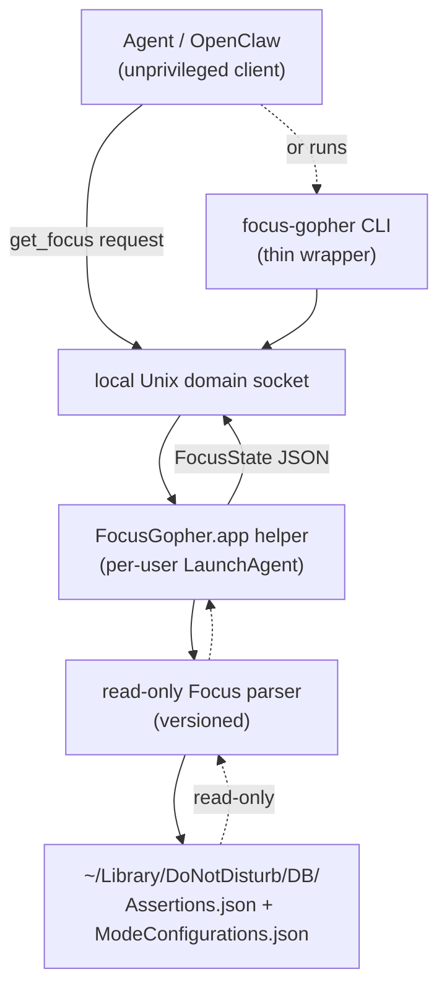

# macOS Focus Gopher Engineering Design

## Overview

Technical design for the **Focus Gopher**: a per-user macOS helper that reads the current Focus /
  Do Not Disturb state and exposes it to local clients through a single read-only operation.
See [macOS Focus Gopher](../product-vision/2026-05-12-macos-focus-gopher.md) for product context,
  [macOS Focus Gopher](../product-requirements/2026-05-12-macos-focus-gopher.md) for the requirement,
  and [macOS Focus Database Format and Stability](../analyses/2026-05-12-macos-focus-db-format.md)
  for the research underpinning the database-reading approach.

The technical problem: macOS Focus state is only available through privacy-gated mechanisms
  (an undocumented database under `~/Library` that generally requires Full Disk Access,
  or Shortcuts/AppleScript which require Automation permissions),
  and macOS attaches those permissions to a specific executable identity.
The Focus Gopher solves this by being a small, stable-identity broker:
  it holds whatever permission macOS requires, performs the privileged read itself,
  and hands clients only a fixed-schema answer — never a general-purpose capability.

## Technology Choices

- **Rust**, building a small headless helper binary plus a thin CLI wrapper.
    The helper is laid out as a macOS `.app` bundle with a stable install path and stable bundle
    identifier, run as a per-user LaunchAgent — that bundle/LaunchAgent *architecture* is the unit the
    macOS TCC (privacy permission) grant attaches to, and none of it depends on the implementation
    language. **Developer ID signing and Apple notarization are a deferred, optional enhancement**
    (delivery-plan M6): the earlier milestones ship build-from-source distribution where the binary is
    unsigned/ad-hoc, so TCC keys the Full Disk Access grant off the binary's cdhash and the user
    re-applies the grant on each upgrade; a Developer ID signature later makes the grant persist across
    upgrades without changing the architecture. See the
    [FDA / signing / distribution analysis](../analyses/2026-05-18-macos-fda-distribution-signing.md).
    Because the helper is headless (no GUI), there is no AppKit/SwiftUI "native feel" to preserve,
    so Rust costs us nothing here and is the team's preferred language for this kind of tool, which
    helps with authoring and review.
- **`serde` / `serde_json`** for the `FocusState` model and the socket protocol; a small blocking
    accept-loop for the socket server (no async runtime needed for a one-shot request/response).
- **LaunchAgent — not a system LaunchDaemon.** Focus state is per-user, the database lives under the
    user's home directory, and GUI-session context may matter; a LaunchAgent runs *in each user's own
    session* with that user's view of these files (one instance per logged-in user), whereas a
    LaunchDaemon would run once as `root` and see the wrong (or no) user context. The plist location
    sets *who it is installed for*, independent of that per-user execution: a shared/system install
    (Homebrew, which has admin rights) places it in **`/Library/LaunchAgents/<bundle-id>.plist`** so it
    runs for every user on the machine; a single-user developer install (e.g. `cargo install`, which is
    per-user and has no admin rights) places it in **`~/Library/LaunchAgents/<bundle-id>.plist`** for
    the current user only.
- **Unix domain socket** for client IPC, created in a per-user, user-only-permissioned location,
    plus a **thin CLI wrapper** (`focus-gopher`) that connects to that socket, performs `get_focus()`,
    and prints the resulting `FocusState` as JSON, exiting non-zero when the outcome is `failed` — so
    callers can use whichever they prefer, and shell scripts can branch on the exit code without parsing
    JSON.
    No network listener is opened.
- **A small line-delimited JSON request/response protocol** over that socket:
    the client sends a fixed request, the helper replies with one `FocusState` JSON object.
    The schema is fixed, versioned, and published as a **JSON Schema** referenced from the docs;
    there is no general "send arbitrary command" path.
- **`cargo test`** for unit and integration tests against fixture database files, consistent with the
    "mocks are usually dumb" principle — fixtures are real captured `Assertions.json` /
    `ModeConfigurations.json` shapes, not mocks.
- **Monorepo conventions:** a `macos-focus-gopher/` directory at the repo root with a `mise.toml`
    exposing `build` / `test` / `lint` / `dependencies:check` / `dependencies:update` / `ci`, wired
    into the root `mise.toml`'s `depends` arrays, with CI invoking those Mise tasks — the same path
    developers run locally.

## Architecture

### Component Flow



The client gets a narrow read-only API — directly over the socket, or via the CLI wrapper.
The helper owns the macOS-specific access and is the only component that touches the database files.

### `FocusState` Data Model

A single fixed-schema object whose shape **mirrors the helper's internal strongly-typed model** rather
  than flattening it onto the wire — so invalid combinations are unrepresentable rather than merely
  discouraged, and there is no divergent hand-maintained projection between the Rust types and the JSON
  (see [the JSON-shape analysis](../analyses/2026-05-12-focus-state-json-shape.md) and
  [Clear, Unambiguous, Easily-Parsed Data Models](../engineering-principles/2026-05-12-clear-data-models.md)).

Shared fields, always present:

- `macos_version` (string) — the detected macOS version (e.g. `"15.5"`).
- `macos_compatibility` — a tagged enum: `supported`, `unsupported`, or `unknown` (the version is on
    neither list). The `unknown` variant carries a `message` asking the user to report whether Focus
    parsing worked on this version; whether it actually *did* work is conveyed by the `outcome`
    (`determined` vs. `failed`), not by this field.

Plus exactly one **outcome**, an externally-tagged discriminated union — the `Result`/`Option` plumbing
  is hidden behind domain-named keys rather than serialized as Rust's `Ok`/`Err`/`null`:

- `determined` — the helper determined the state; its value is itself a tagged union:
  - `focus_on` — a Focus is active; carries its human-readable `name` (always present: in normal
      operation an active Focus is nameable, so an active-but-unnameable Focus is reported as `failed`
      with `focus_name_unresolved`, not as a success — see the error taxonomy below).
  - `focus_off` — no Focus is active (an empty object).
- `failed` — the helper could not determine the state. Carries a stable machine-readable `error` code
    (see the error taxonomy below) plus a human-readable `message` with guidance for that error (the
    FDA-grant instructions for `focus_permission_denied`, a "file an issue/PR" nudge otherwise).

The internal Rust model the wire mirrors:

```rust
struct FocusState {
    macos_version: String,
    macos_compatibility: MacosCompatibility,
    outcome: Outcome,                 // #[serde(flatten)]
}

#[serde(rename_all = "snake_case")]   // externally tagged: "supported" | "unsupported" | "unknown"
enum MacosCompatibility {
    Supported,
    Unsupported,
    Unknown { message: String },
}

#[serde(rename_all = "snake_case")]   // externally tagged: "determined" | "failed"
enum Outcome {
    Determined(Focus),
    Failed { error: ErrorCode, message: String },
}

#[serde(rename_all = "snake_case")]   // externally tagged: "focus_on" | "focus_off"
enum Focus {
    FocusOn { name: String },
    FocusOff {},
}
```

Why this shape rather than a flat object of nullable siblings: the helper has no HTTP transport whose
  status code could carry the success-vs-failure discriminant, so the body must — which puts us with
  JSON-RPC / LSP, where the idiom is a structural discriminated union, not optional sibling fields. An
  externally-tagged union is also serde's natural projection of the internal sum type, so the wire *is*
  the serialized model (no divergent mapping layer to drift out of sync), and the published JSON Schema's
  `oneOf` makes the illegal combinations unrepresentable on the wire as well. The CLI wrapper carries the
  success/failure signal redundantly in its exit code (non-zero iff `failed`). See [the JSON-shape
  analysis](../analyses/2026-05-12-focus-state-json-shape.md). The response shapes:

```jsonc
// (a) determined, Focus on
{ "macos_version": "15.5", "macos_compatibility": "supported",
  "determined": { "focus_on": { "name": "Sleep" } } }

// (b) determined, Focus off
{ "macos_version": "15.5", "macos_compatibility": "supported",
  "determined": { "focus_off": {} } }

// (c) determined on an unknown (unlisted) macOS version — the unknown variant carries the report message
{ "macos_version": "26.0",
  "macos_compatibility": { "unknown": { "message": "macOS 26.0 is not on the known-supported list. Please file an issue or PR reporting whether Focus parsing works here, so it can be added." } },
  "determined": { "focus_on": { "name": "Do Not Disturb" } } }

// (d) failure — the failed variant carries the guidance message (here, FDA remediation)
{ "macos_version": "15.5", "macos_compatibility": "supported",
  "failed": { "error": "focus_permission_denied",
    "message": "Full Disk Access is required. Grant it to /Applications/FocusGopher.app under System Settings > Privacy & Security > Full Disk Access, then retry." } }
```

### Retrieval Pipeline

1. Detect the macOS version.
2. Look the version up in the compatibility table.
3. Read `~/Library/DoNotDisturb/DB/Assertions.json`; determine whether an active Focus assertion exists.
    An empty/near-empty file means no manually-activated Focus — a valid result, not an error.
4. Consult `~/Library/DoNotDisturb/DB/ModeConfigurations.json` for a Focus activated by schedule or
    automation (reflected in the mode's trigger/enabled state rather than in `Assertions.json`).
5. If no Focus is active by either path: return `determined` → `focus_off`.
6. If a Focus is active: extract the active Focus identifier.
7. Map the identifier to a human-readable name via `ModeConfigurations.json` (and a fixed
    identifier→name table for built-in Foci).
8. Return `determined` → `focus_on` with `name: <name>`. If the active Focus's identifier cannot be
    mapped to a name, return `failed` with `focus_name_unresolved` — in normal operation an active Focus
    is always nameable, so this signals a schema/coverage gap, not a steady-state success.
9. If parsing succeeded but the macOS version is not on the known-supported list:
    set `macos_compatibility` to the `unknown` variant, carrying a `message` asking the user to report
    whether parsing worked (independent of the outcome).
10. If any step fails (permission-denied, missing/unreadable/malformed/partially-written file, or
    unrecognized schema): return `failed` with an explicit `error` code and a guidance `message`, never
    a `determined` result.

The parser is **versioned and swappable**: the macOS Focus database format is undocumented and may
  change between releases, so the parsing logic is internal and may be reorganized per macOS version
  without changing the `get_focus() -> FocusState` interface.
The stable interface is the contract; the schema is not.
See [the format-stability analysis](../analyses/2026-05-12-macos-focus-db-format.md) for how the format
  has held up across macOS 12–15 and what that means for the compatibility table.

### Error Taxonomy

A small, stable set of `error` codes, e.g.:

- `focus_permission_denied` — the Focus database exists but the helper was denied access to it
    (an `EPERM` on `open()`), overwhelmingly meaning the helper has not been granted Full Disk Access.
- `focus_db_unreadable` — a required database file is genuinely missing or otherwise unreadable for a
    reason other than a permission denial.
- `focus_db_malformed` — a database file exists but is not parseable (truncated/partial write, invalid JSON).
- `schema_unknown` — the file parsed as JSON but its structure does not match any known schema.
- `focus_name_unresolved` — an active Focus was detected but its identifier could not be mapped to a
    human-readable name. In normal operation an active Focus is always nameable, so this indicates a
    schema/coverage gap (e.g. a new built-in identifier) worth reporting — not a steady-state result —
    and the *name* is the primary thing consumers want, so a nameless "Focus is on" is treated as a
    failure rather than a partial success.
- `macos_unsupported` — the running macOS version is explicitly marked unsupported in the compatibility table.
- `internal_error` — an unexpected helper-side failure.

New codes may be added; existing codes are not repurposed.

`focus_permission_denied` is a distinct, first-class code because Full Disk Access can never be granted
  programmatically — it is always a manual System Settings step, and on the unsigned/from-source
  channels it must be re-applied after every upgrade. The `failed` variant's `message` is therefore
  *actionable* text (no structured `grant_path` field — that would be detail nobody asked for): the
  *canonical resolved* helper binary path to add (cargo and Homebrew both symlink into `bin/`, and TCC
  matches the real binary), plus the
  `x-apple.systempreferences:com.apple.preference.security?Privacy_AllFiles` deep link. A missing FDA
  grant is **never** collapsed into a `determined` result. Detection is reactive: a denied
  `open()` on the protected, existing file returns `EPERM` (not `ENOENT`); because the protecting
  directory is itself TCC-gated, a would-be `ENOENT` can also surface as `EPERM` when unprivileged, so
  `EPERM` is treated as the dependable "denied" signal while `ENOENT` is only trusted as "absent" once
  access is confirmed (the benign "Focus off" state is empty *content*, not an absent file). See the
  [FDA / signing / distribution analysis](../analyses/2026-05-18-macos-fda-distribution-signing.md).

## Configuration

- **Install path:** `/Applications/FocusGopher.app` (stable; updated infrequently). A build-from-source
    install (the Homebrew formula/tap, or `cargo install`) installs the bundle, registers the
    LaunchAgent, and links the `focus-gopher` CLI onto the user's `PATH`; the optional M6 cask installs
    the prebuilt signed + notarized bundle at the same path.
- **Bundle identifier:** `justdavis.FocusGopher` (stable once shipped).
- **Full Disk Access & distribution:** the helper requires Full Disk Access to read the Focus
    database. That grant is always a manual System Settings action (no programmatic prompt exists on
    any channel), and on the unsigned build-from-source channels it is keyed to the binary's cdhash, so
    it must be re-applied after each upgrade; Developer ID signing + notarization (M6, optional) makes
    it persist across upgrades and improves first-run OS signposting. The install/uninstall flow and
    docs surface the exact grant steps. See the
    [FDA / signing / distribution analysis](../analyses/2026-05-18-macos-fda-distribution-signing.md).
- **LaunchAgent plist:** `/Library/LaunchAgents/<bundle-id>.plist` for a shared/system install
    (the Homebrew path — installs once for all users), or `~/Library/LaunchAgents/<bundle-id>.plist`
    for a single-user developer install (e.g. `cargo install`); either way it registers the helper to
    run in each user's session and is installed/removed by the install/uninstall flow.
- **Socket path:** macOS has no `XDG_RUNTIME_DIR`-style blessed per-user socket directory (no
    `/run/user/<uid>/`), and `sockaddr_un.sun_path` is capped (~104 bytes), so the path is a
    deliberate, short choice. The helper places the socket directly in **`$TMPDIR`**
    (`confstr(_CS_DARWIN_USER_TEMP_DIR)`, e.g. `/var/folders/…/T/`): `$TMPDIR/focus-gopher.sock`.
    On macOS `$TMPDIR` is a per-user, mode-`0700`, user-owned directory, and **that ownership is the
    access control**: a socket inside it is reachable only by its owner, so no other user can connect
    to it or pre-create it to impersonate the helper. Consequently the path needs no uid for
    namespacing (there is no shared directory to disambiguate), and the helper needs no explicit
    peer-uid check on connect — both would be redundant with the directory's semantics, and the
    peer-uid check would also require `unsafe` FFI on macOS (no stable safe wrapper exists). If
    `$TMPDIR` is unset the helper errors rather than falling back to a shared, world-writable location
    like `/tmp`. (`~/Library/Application Support/<bundle-id>/` is idiomatic for app *data* but is the
    deepest option and the most likely to overflow the `sun_path` limit.) The preferred long-term
    mechanism is a **`launchd`-managed socket** — a `Sockets` / `SockPathName` entry in the LaunchAgent
    plist so `launchd` creates, owns, and tears it down and hands the helper the descriptor via
    `launch_activate_socket()` — which can later replace the self-managed bind without other changes.
    No network listener; the CLI wrapper uses the same path.
- **`FocusState` JSON Schema:** a versioned schema published in the repository and referenced by the
    README and `--help`/`man` docs.
- **macOS compatibility table:** maintained in the project repository as the source of truth, seeded
    per [the format-stability analysis](../analyses/2026-05-12-macos-focus-db-format.md) — keyed by
    macOS version string, with specific point releases or major-version wildcards (the latter only
    where the analysis supports it and the parser is verified against a current point release);
    the helper's `macos_compatibility` output is derived from it.
- **Data sources (read-only):** `~/Library/DoNotDisturb/DB/Assertions.json` and
    `~/Library/DoNotDisturb/DB/ModeConfigurations.json` — undocumented macOS internals,
    subject to change across releases.

## Trade-Offs

- **A stable-identity helper vs. granting the agent Full Disk Access directly.**
    Chosen: the helper. Granting Full Disk Access to an internet-connected, tool-using,
    prompt-injectable agent has an enormous blast radius, and the grant is attached to an agent identity
    that churns (rebuilds, reinstalls, different launchers). The helper confines the powerful permission
    to a small, audited, stable binary and hands the agent only the answer.
- **Per-user LaunchAgent serving a socket (+ thin CLI) vs. a plain CLI binary.**
    Chosen: the LaunchAgent + socket, with the CLI as a thin client of it. A persistent agent process
    is what carries the stable identity that owns the Full Disk Access grant; a freshly-invoked CLI
    runs under the caller's responsible-process identity, and TCC/Full Disk Access for ad-hoc
    command-line tools is unreliable. The thin CLI wrapper gives consumers command-line ergonomics
    without giving up the stable-identity broker. The delivery plan includes an explicit checkpoint to
    validate agent-integration ergonomics at the MVP and revisit this if the socket proves awkward.
- **Signed + notarized prebuilt distribution vs. build-from-source.**
    Chosen: build-from-source (`cargo install`, Homebrew formula/tap) for the delivered milestones,
    with Developer ID signing + notarization + a cask as an *optional* later enhancement (M6).
    Signing/notarization cannot grant Full Disk Access programmatically and cannot remove the one-time
    manual grant; their only benefits are that the grant *persists across upgrades* and that the OS
    signposts the grant better (an out-of-band System Settings redirect dialog + FDA-pane pre-listing
    for signed apps — a human-facing side channel the helper never sees, since the FDA-gated read still
    returns the same permission error either way) — real but incremental UX wins that cost an Apple
    Developer Program membership and release-pipeline complexity. The from-source path delivers full functionality now,
    at the cost of the user re-granting Full Disk Access on each upgrade, which the explicit
    `focus_permission_denied` code, the actionable message, and the docs are designed to make
    painless. See the
    [FDA / signing / distribution analysis](../analyses/2026-05-18-macos-fda-distribution-signing.md).
- **Reading the undocumented database vs. Shortcuts / AppleScript / a public API.**
    Chosen: read the database, inside the helper. There is no stable public API for "current Focus
    state"; Shortcuts and AppleScript require Automation permissions and would widen the helper's
    capability surface (it would have to be able to run shortcuts or scripts), and a Shortcut-based
    approach is also much harder to distribute and install (you can't `brew install` a Shortcut).
    Reading two JSON files read-only is the narrowest mechanism, at the cost of being undocumented and
    version-fragile — which the compatibility table, the format-stability analysis, and explicit-failure
    handling are designed to absorb.
- **Rust vs. Swift.**
    Chosen: Rust. The helper is a headless background process, so there is no AppKit/SwiftUI "native
    feel" at stake; a Rust binary packages into an `.app` and a LaunchAgent just as well (signed or
    not), and the TCC grant attaches to the bundle, not the language. Rust is the team's preferred
    language for tools like this, which improves authoring and review. Swift would only win if deep
    macOS-framework integration were needed — reading two JSON files does not require it. If a future
    version needs significant native-framework work, this can be revisited.
- **Fail explicitly on schema change vs. best-effort guessing.**
    Chosen: fail explicitly with an `error` code. A wrong guess that reports "no Focus is on"
    when parsing actually failed is a silent, dangerous error;
    an explicit failure tells the consumer the state is unknown and tells the user to report it.
- **A fixed-schema single operation vs. a general RPC surface.**
    Chosen: `get_focus()` and nothing else. A general RPC surface (read arbitrary files, run shell,
    run shortcuts, run AppleScript) would re-create exactly the over-broad capability the design exists
    to avoid. See [Least Privilege](../engineering-principles/2026-05-12-least-privilege.md).
- **An externally-tagged discriminated union mirroring the internal model vs. a flat object of nullable
    siblings.**
    Chosen: the externally-tagged union (`determined`/`failed`, with `focus_on`/`focus_off` inside
    `determined`). A flat object (`ok`/`focus_enabled`/`focus_name`/`error` as nullable siblings) would
    be serde's fragile *untagged* shape — variants told apart only by which optional fields happen to be
    present — and a hand-maintained flattening that can drift from the Rust sum type. We have no HTTP
    status code to carry the success-vs-failure discriminant, so (like JSON-RPC / LSP) the body carries
    it structurally; the tagged union *is* the serialized internal sum type (no divergent mapping), makes
    illegal states unrepresentable on the wire as well as in code, and is obvious to a human without
    consulting the schema. The earlier flat recommendation leaned on REST APIs whose flatness is enabled
    by an HTTP status discriminant we do not have. The success/failure signal is *also* carried in the
    CLI wrapper's exit code (non-zero iff `failed`). See
    [the JSON-shape analysis](../analyses/2026-05-12-focus-state-json-shape.md).

## Success Criteria

- An agent can retrieve the current Focus state via a single local call (socket or CLI wrapper).
- The agent itself has no Full Disk Access (or any other broad macOS privacy permission).
- The helper has a stable macOS identity: a fixed install path and bundle ID on every channel, plus a
    stable Developer ID signing identity on the optional signed channel (M6).
- A missing Full Disk Access grant is surfaced as `failed` with the dedicated `focus_permission_denied`
    error and an actionable, deep-linked `message`, never as a `determined` result, and the docs explain
    exactly how to grant (and, on from-source channels, re-grant) Full Disk Access.
- The helper exposes only a narrow read-only API (`get_focus()`), and no arbitrary filesystem,
    shell, Shortcut, or AppleScript access.
- Rebuilding or upgrading the agent does not break the helper's TCC permissions.
- The helper distinguishes *no Focus*, *active Focus* (always named), and *error* states (an
    active-but-unnameable Focus is an error, `focus_name_unresolved`).
- The helper reports known/unknown macOS compatibility.
- The helper never exposes arbitrary filesystem, shell, Shortcut, or AppleScript access.
- The parser correctly handles fixture databases for each supported macOS major version
    (manual-Focus-on, scheduled-Focus-on, Focus-off including the empty-file case, malformed,
    unknown-schema, permission-denied, and active-but-unnameable fixtures), verified against a current
    point release of each.
- A schema change or parse failure is surfaced as `failed` with an explicit `error`, never as a
    `determined` result.
- A versioned JSON Schema for `FocusState` is published and the helper's output validates against it.
- The helper installs with a single command via `cargo install` or Homebrew (formula/tap; the optional
    M6 cask for the signed build).

## References

- **Product Vision**: [macOS Focus Gopher](../product-vision/2026-05-12-macos-focus-gopher.md).
- **Product Requirements**: [macOS Focus Gopher](../product-requirements/2026-05-12-macos-focus-gopher.md).
- **Analyses**: [macOS Focus Database Format and Stability](../analyses/2026-05-12-macos-focus-db-format.md);
    [`FocusState` JSON Response Shape: Flat vs. Tagged Union](../analyses/2026-05-12-focus-state-json-shape.md);
    [macOS Full Disk Access, Code Signing, and Distribution Channels](../analyses/2026-05-18-macos-fda-distribution-signing.md).
- **Delivery Plan**: [macOS Focus Gopher Delivery Plan](../delivery-plans/2026-05-12-macos-focus-gopher.md).
- **Engineering Principles**:
    [Least Privilege](../engineering-principles/2026-05-12-least-privilege.md);
    [Clear, Unambiguous, Easily-Parsed Data Models](../engineering-principles/2026-05-12-clear-data-models.md);
    [Strong Typing and Information Preservation](../engineering-principles/2026-01-07-strong-typing.md);
    [Comprehensive Error Modeling](../engineering-principles/2026-01-08-error-modeling.md);
    [Fail Fast and Loud](../engineering-principles/2026-01-09-fail-fast.md);
    [YAGNI](../engineering-principles/2026-01-06-yagni.md) — e.g. no `normalized`/`source` fields,
    and no list of all known-compatible macOS versions, without a concrete consumer.
