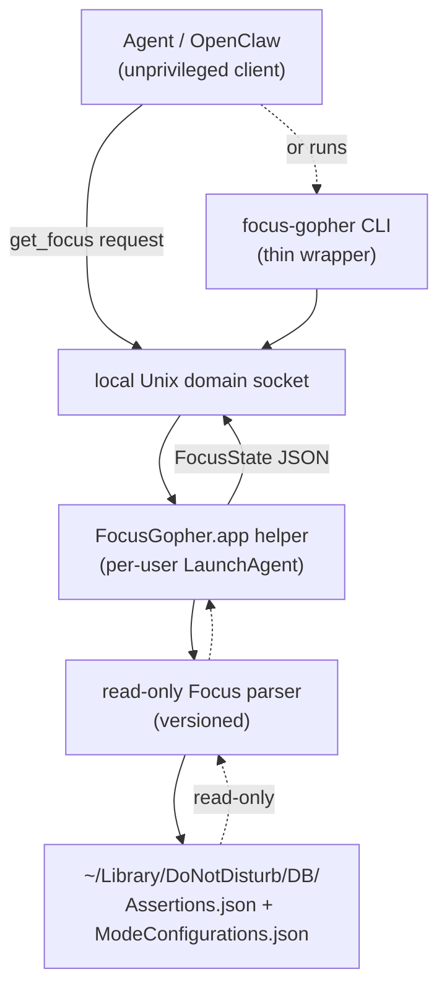

# macOS Focus Gopher Engineering Design

## Overview

Technical design for the **Focus Gopher**: a per-user macOS helper that reads the current Focus /
  Do Not Disturb state and exposes it to local clients through a single read-only operation.
See [macOS Focus Gopher](../product-vision/2026-05-12-macos-focus-gopher.md) for product context,
  [macOS Focus Gopher](../product-requirements/2026-05-12-macos-focus-gopher.md) for the requirement,
  and [macOS Focus Database Format and Stability](../analyses/2026-05-12-macos-focus-db-format.md)
  for the research underpinning the database-reading approach.

The technical problem: macOS Focus state is only available through privacy-gated mechanisms
  (an undocumented database under `~/Library` that generally requires Full Disk Access,
  or Shortcuts/AppleScript which require Automation permissions),
  and macOS attaches those permissions to a specific executable identity.
The Focus Gopher solves this by being a small, stable-identity broker:
  it holds whatever permission macOS requires, performs the privileged read itself,
  and hands clients only a fixed-schema answer — never a general-purpose capability.

## Technology Choices

- **Rust**, building a small headless helper binary plus a thin CLI wrapper.
    The helper is packaged as a code-signed and notarized macOS `.app` bundle so it has a stable bundle
    identifier, a stable signing identity, and a TCC (privacy permission) grant that attaches to the
    bundle's code signature — none of which depends on the implementation language.
    Because the helper is headless (no GUI), there is no AppKit/SwiftUI "native feel" to preserve,
    so Rust costs us nothing here and is the team's preferred language for this kind of tool, which
    helps with authoring and review.
- **`serde` / `serde_json`** for the `FocusState` model and the socket protocol; a small blocking
    accept-loop for the socket server (no async runtime needed for a one-shot request/response).
- **Per-user LaunchAgent** (`~/Library/LaunchAgents/<bundle-id>.plist`) — not a system LaunchDaemon.
    Focus state is per-user, the database lives under the user's home directory,
    and GUI-session context may matter; a LaunchAgent runs in the user's session with the user's view
    of these files.
- **Unix domain socket** for client IPC, created in a per-user, user-only-permissioned location,
    plus a **thin CLI wrapper** (`focus-gopher`) that connects to that socket, performs `get_focus()`,
    and prints the resulting `FocusState` as JSON — so callers can use whichever they prefer.
    No network listener is opened.
- **A small line-delimited JSON request/response protocol** over that socket:
    the client sends a fixed request, the helper replies with one `FocusState` JSON object.
    The schema is fixed, versioned, and published as a **JSON Schema** referenced from the docs;
    there is no general "send arbitrary command" path.
- **`cargo test`** for unit and integration tests against fixture database files, consistent with the
    "mocks are usually dumb" principle — fixtures are real captured `Assertions.json` /
    `ModeConfigurations.json` shapes, not mocks.
- **Monorepo conventions:** a `macos-focus-gopher/` directory at the repo root with a `mise.toml`
    exposing `build` / `test` / `lint` / `dependencies:check` / `dependencies:update` / `ci`, wired
    into the root `mise.toml`'s `depends` arrays, with CI invoking those Mise tasks — the same path
    developers run locally.

## Architecture

### Component flow



The client gets a narrow read-only API — directly over the socket, or via the CLI wrapper.
The helper owns the macOS-specific access and is the only component that touches the database files.

### `FocusState` data model

A single, flat, fixed-schema object, deliberately separating orthogonal facts so consumers never have
  to guess (see
  [Clear, Unambiguous, Easily-Parsed Data Models](../engineering-principles/2026-05-12-clear-data-models.md)):

- `ok` (bool) — did the helper determine the Focus state?
- `focus_enabled` (bool?) — is a Focus active? `null` only when `ok` is `false`.
- `focus_name` (string?) — the human-readable Focus name; `null` when Focus is off,
    when the name could not be resolved, or when `ok` is `false`.
- `macos_version` (string) — the detected macOS version (e.g. `"15.5"`).
- `macos_compatibility` (enum) — `supported` | `unknown_but_working` | `unknown` | `unsupported`.
- `message` (string?) — human-readable guidance only; never used for program logic.
- `error` (string) — present on failures; a stable machine-readable code (see error taxonomy below).

The model is intentionally flat: it is one small response, so flat well-named fields parse most easily;
  the clarity comes from the orthogonal fields, not from nesting. The four response shapes:

```json
// (a) success, Focus on
{"ok": true, "focus_enabled": true, "focus_name": "Sleep",
 "macos_version": "15.5", "macos_compatibility": "supported", "message": null}

// (b) success, no Focus on
{"ok": true, "focus_enabled": false, "focus_name": null,
 "macos_version": "15.5", "macos_compatibility": "supported", "message": null}

// (c) success on an unknown-but-working macOS version
{"ok": true, "focus_enabled": true, "focus_name": "Do Not Disturb",
 "macos_version": "26.0", "macos_compatibility": "unknown_but_working",
 "message": "This macOS version is not listed as known-supported, but Focus parsing appears to be working. Please submit an issue or PR marking macOS 26.0 as compatible if this result is correct."}

// (d) failure
{"ok": false, "focus_enabled": null, "focus_name": null,
 "macos_version": "26.0", "macos_compatibility": "unknown", "error": "focus_db_unreadable",
 "message": "Focus state could not be determined on this macOS version. Please file an issue or PR with your macOS version, helper version, and this error code."}
```

### Retrieval pipeline

1. Detect the macOS version.
2. Look the version up in the compatibility table.
3. Read `~/Library/DoNotDisturb/DB/Assertions.json`; determine whether an active Focus assertion exists.
    An empty/near-empty file means no manually-activated Focus — a valid result, not an error.
4. Consult `~/Library/DoNotDisturb/DB/ModeConfigurations.json` for a Focus activated by schedule or
    automation (reflected in the mode's trigger/enabled state rather than in `Assertions.json`).
5. If no Focus is active by either path: return `ok: true`, `focus_enabled: false`, `focus_name: null`.
6. If a Focus is active: extract the active Focus identifier.
7. Map the identifier to a human-readable name via `ModeConfigurations.json` (and a fixed
    identifier→name table for built-in Foci).
8. Return `ok: true`, `focus_enabled: true`, `focus_name: <name>`
    (or `focus_name: null` if the identifier could not be mapped).
9. If parsing succeeded but the macOS version is not on the known-supported list:
    set `macos_compatibility: unknown_but_working` and the corresponding `message`.
10. If any step fails (missing/unreadable/malformed/partially-written file, or unrecognized schema):
    return `ok: false` with an explicit `error` code, never `focus_enabled: false`.

The parser is **versioned and swappable**: the macOS Focus database format is undocumented and may
  change between releases, so the parsing logic is internal and may be reorganized per macOS version
  without changing the `get_focus() -> FocusState` interface.
The stable interface is the contract; the schema is not.
See [the format-stability analysis](../analyses/2026-05-12-macos-focus-db-format.md) for how the format
  has held up across macOS 12–15 and what that means for the compatibility table.

### Error taxonomy

A small, stable set of `error` codes, e.g.:

- `focus_db_unreadable` — a required database file is missing, permission-denied, or otherwise unreadable.
- `focus_db_malformed` — a database file exists but is not parseable (truncated/partial write, invalid JSON).
- `schema_unknown` — the file parsed as JSON but its structure does not match any known schema.
- `macos_unsupported` — the running macOS version is explicitly marked unsupported in the compatibility table.
- `internal_error` — an unexpected helper-side failure.

New codes may be added; existing codes are not repurposed.

## Configuration

- **Install path:** `/Applications/FocusGopher.app` (stable; updated infrequently). The Homebrew
    formula/tap installs the bundle, registers the LaunchAgent, and links the `focus-gopher` CLI onto
    the user's `PATH`.
- **Bundle identifier:** `justdavis.FocusGopher` (stable once shipped).
- **LaunchAgent plist:** `~/Library/LaunchAgents/<bundle-id>.plist`, registering the helper to run
    in the user's session; installed/removed by the install/uninstall flow.
- **Socket path:** a per-user, user-only-permissioned path (e.g. under the user's
    `~/Library/Application Support/<bundle-id>/` or a per-user temporary directory);
    no network listener. The CLI wrapper knows this path.
- **`FocusState` JSON Schema:** a versioned schema published in the repository and referenced by the
    README and `--help`/`man` docs.
- **macOS compatibility table:** maintained in the project repository as the source of truth, seeded
    per [the format-stability analysis](../analyses/2026-05-12-macos-focus-db-format.md) — keyed by
    macOS version string, with specific point releases or major-version wildcards (the latter only
    where the analysis supports it and the parser is verified against a current point release);
    the helper's `macos_compatibility` output is derived from it.
- **Data sources (read-only):** `~/Library/DoNotDisturb/DB/Assertions.json` and
    `~/Library/DoNotDisturb/DB/ModeConfigurations.json` — undocumented macOS internals,
    subject to change across releases.

## Trade-offs

- **A stable-identity helper vs. granting the agent Full Disk Access directly.**
    Chosen: the helper. Granting Full Disk Access to an internet-connected, tool-using,
    prompt-injectable agent has an enormous blast radius, and the grant is attached to an agent identity
    that churns (rebuilds, reinstalls, different launchers). The helper confines the powerful permission
    to a small, audited, stable binary and hands the agent only the answer.
- **Per-user LaunchAgent serving a socket (+ thin CLI) vs. a plain CLI binary.**
    Chosen: the LaunchAgent + socket, with the CLI as a thin client of it. A persistent agent process
    is what carries the stable identity that owns the Full Disk Access grant; a freshly-invoked CLI
    runs under the caller's responsible-process identity, and TCC/Full Disk Access for ad-hoc
    command-line tools is unreliable. The thin CLI wrapper gives consumers command-line ergonomics
    without giving up the stable-identity broker. The delivery plan includes an explicit checkpoint to
    validate agent-integration ergonomics at the MVP and revisit this if the socket proves awkward.
- **Reading the undocumented database vs. Shortcuts / AppleScript / a public API.**
    Chosen: read the database, inside the helper. There is no stable public API for "current Focus
    state"; Shortcuts and AppleScript require Automation permissions and would widen the helper's
    capability surface (it would have to be able to run shortcuts or scripts), and a Shortcut-based
    approach is also much harder to distribute and install (you can't `brew install` a Shortcut).
    Reading two JSON files read-only is the narrowest mechanism, at the cost of being undocumented and
    version-fragile — which the compatibility table, the format-stability analysis, and explicit-failure
    handling are designed to absorb.
- **Rust vs. Swift.**
    Chosen: Rust. The helper is a headless background process, so there is no AppKit/SwiftUI "native
    feel" at stake; a Rust binary packages into a code-signed/notarized `.app` and a LaunchAgent just
    as well, and the TCC grant attaches to the bundle, not the language. Rust is the team's preferred
    language for tools like this, which improves authoring and review. Swift would only win if deep
    macOS-framework integration were needed — reading two JSON files does not require it. If a future
    version needs significant native-framework work, this can be revisited.
- **Fail explicitly on schema change vs. best-effort guessing.**
    Chosen: fail explicitly with an `error` code. A wrong guess that reports "no Focus is on"
    when parsing actually failed is a silent, dangerous error;
    an explicit failure tells the consumer the state is unknown and tells the user to report it.
- **A fixed-schema single operation vs. a general RPC surface.**
    Chosen: `get_focus()` and nothing else. A general RPC surface (read arbitrary files, run shell,
    run shortcuts, run AppleScript) would re-create exactly the over-broad capability the design exists
    to avoid. See [Least Privilege](../engineering-principles/2026-05-12-least-privilege.md).

## Success Criteria

- An agent can retrieve the current Focus state via a single local call (socket or CLI wrapper).
- The agent itself has no Full Disk Access (or any other broad macOS privacy permission).
- The helper has a stable macOS identity (fixed install path, bundle ID, signing identity).
- The helper exposes only a narrow read-only API (`get_focus()`), and no arbitrary filesystem,
    shell, Shortcut, or AppleScript access.
- Rebuilding or upgrading the agent does not break the helper's TCC permissions.
- The helper distinguishes *no Focus*, *active Focus* (named or unnamed), and *error* states.
- The helper reports known/unknown macOS compatibility.
- The helper never exposes arbitrary filesystem, shell, Shortcut, or AppleScript access.
- The parser correctly handles fixture databases for each supported macOS major version
    (manual-Focus-on, scheduled-Focus-on, Focus-off including the empty-file case, malformed, and
    unknown-schema fixtures), verified against a current point release of each.
- A schema change or parse failure is surfaced as an explicit `error`, never as
    `ok: true, focus_enabled: false`.
- A versioned JSON Schema for `FocusState` is published and the helper's output validates against it.
- The helper installs with a single Homebrew command.

## References

- **Product Vision**: [macOS Focus Gopher](../product-vision/2026-05-12-macos-focus-gopher.md).
- **Product Requirements**: [macOS Focus Gopher](../product-requirements/2026-05-12-macos-focus-gopher.md).
- **Analysis**: [macOS Focus Database Format and Stability](../analyses/2026-05-12-macos-focus-db-format.md).
- **Delivery Plan**: [macOS Focus Gopher Delivery Plan](../delivery-plans/2026-05-12-macos-focus-gopher.md).
- **Engineering Principles**:
    [Least Privilege](../engineering-principles/2026-05-12-least-privilege.md);
    [Clear, Unambiguous, Easily-Parsed Data Models](../engineering-principles/2026-05-12-clear-data-models.md);
    [Strong Typing and Information Preservation](../engineering-principles/2026-01-07-strong-typing.md);
    [Comprehensive Error Modeling](../engineering-principles/2026-01-08-error-modeling.md);
    [Fail Fast and Loud](../engineering-principles/2026-01-09-fail-fast.md);
    [YAGNI](../engineering-principles/2026-01-06-yagni.md) — e.g. no `normalized`/`source` fields,
    and no list of all known-compatible macOS versions, without a concrete consumer.
